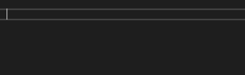

# unity-snippets

Provide C# snippets to code even faster!

## How to import in Visual Studio

- Tools > Code Snippets Manager... > Import...
- Select the files and import
- You are done

## How to use it?

Simply type the snippet (`sc`, `spf` etc.) then "tab" twice.<br>Use tab to navigate between the fields.



## Snippets Unity

### sc : serializable class

```csharp
[Serializable]
$visibility$ class $name$
{
}
```

### spf : serialized private field

```csharp
[SerializeField]
private $type$ $field$;
```

### sprop : property bound to serialize field (full but short syntax) 

```csharp
[SerializeField]
private $type$ $field$;
public $type$ $property$ { get => $field$; set => $field$ = value; }
```

### spropf : property bound to serialized field (full with long syntax) 

```csharp
[SerializeField]
private $type$ $field$;
public $type$ $property$
{
	get { return $field$;}
	set { $field$ = value;}
}
```

### spropg : property with getter on the serialized private field

```csharp
[SerializeField]
private $type$ $field$;
public $type$ $property$ => $field$;
```

## Snippets Odin for Unity

### fg

```csharp
[FoldoutGroup("$groupName$")]
```
### reqe

```csharp
[Required(InfoMessageType.Error)]
```
### reqw

```csharp
[Required(InfoMessageType.Warning)]
```

